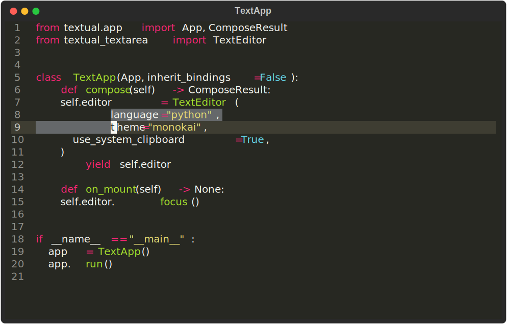

# Textual Textarea


## Note: This is **NOT** the official TextArea widget!

With v0.38.0, Textual added a built-in TextArea widget. You probably want to use 
that widget instead of this one. This project predated the official widget; versions < v0.8.0
had a completely separate implmentation.

Since v0.8.0, this project uses the built-in TextArea widget, but adds the features outlined below.

## Installation

```
pip install textual-textarea
```

## Features
Full-featured text editor experience with VS-Code-like bindings, in your Textual App:
- Syntax highlighting and support for Pygments themes.
- Move cursor and scroll with mouse or keys (including <kbd>ctrl+arrow</kbd>, <kbd>PgUp/Dn</kbd>,  <kbd>ctrl+Home/End</kbd>).
- Open (<kbd>ctrl+o</kbd>) and save (<kbd>ctrl+s</kbd>) files.
- Cut (<kbd>ctrl+x</kbd>), copy (<kbd>ctrl+c</kbd>), paste (<kbd>ctrl+u/v</kbd>), optionally using the system clipboard.
- Comment selections with <kbd>ctrl+/</kbd>.
- Indent and dedent (optionally for a multiline selection) to tab stops with <kbd>Tab</kbd> and <kbd>shift+Tab</kbd>.
- Automatic completions of quotes and brackets.
- Select text by double-, triple-, or quadruple-clicking.
- Quit with <kbd>ctrl+q</kbd>.

## Usage

### Initializing the Widget

The TextArea is a Textual Widget. You can add it to a Textual
app using `compose` or `mount`:

```python
from textual_textarea import TextEditor
from textual.app import App, ComposeResult

class TextApp(App, inherit_bindings=False):
    def compose(self) -> ComposeResult:
        yield TextEditor(text="hi", language="python", theme="nord-darker", id="ta")

    def on_mount(self) -> None:
        editor = self.query_one("#id", expect_type=TextEditor)
        editor.focus()

app = TextApp()
app.run()
```

In addition to the standard Widget arguments, TextArea accepts three additional, optional arguments when initializing the widget:

- language (str): Must be `None` or the short name of a [Pygments lexer](https://pygments.org/docs/lexers/), e.g., `python`, `sql`, `as3`. Defaults to `None`.
- theme (str): Must be name of a [Pygments style](https://pygments.org/styles/), e.g., `bw`, `github-dark`, `solarized-light`. Defaults to `monokai`.
- use_system_clipboard (bool): Set to `False` to make the TextArea's copy and paste operations ignore the system clipboard. Defaults to `True`. Some Linux users may need to apt-install `xclip` or `xsel` to enable the system clipboard features.

The TextArea supports many actions and key bindings. **For proper binding of `ctrl+c` to the COPY action,
you must initialize your App with `inherit_bindings=False`** (as shown above), so that `ctrl+c` does not quit the app. The TextArea implements `ctrl+q` as quit; you way wish to mimic that in your app so that other in-focus widgets use the same behavior.

### Interacting with the Widget

#### Getting and Setting Text

The TextArea exposes a `text` property that contains the full text contained in the widget. You can retrieve or set the text by interacting with this property:

```python
editor = self.query_one(TextEditor)
old_text = editor.text
editor.text = "New Text!\n\nMany Lines!"
```

Similarly, the TextEditor exposes a `selected_text` property (read-only):
```python
editor = self.query_one(TextEditor)
selection = editor.selected_text
```

#### Inserting Text

You can insert text at the current selection:
```python
editor = self.query_one(TextEditor)
editor.text = "01234"
editor.selection = Selection((0, 2), (0, 2))
editor.insert_text_at_selection("\nabc\n")
assert editor.text == "01\nabc\n234"
assert editor.selection == Selection((2, 0), (2, 0))
```

#### Getting and Setting The Cursor Position

The TextEditor exposes a `selection` property that returns a textual.widgets.text_area.Selection:

```python
editor = self.query_one(TextEditor)
old_selection = editor.selection
editor.selection = Selection((999, 0),(999, 0))  # the cursor will move as close to line 999, pos 0 as possible
cursor_line_number = editor.selection.end[0]
cursor_x_position = editor.selection.end[1]
```


#### Getting and Setting The Language

Syntax highlighting and comment insertion depends on the configured language for the TextEditor.

The TextArea exposes a `language` property that returns `None` or a string that is equal to the short name of an installed tree-sitter language:

```python
editor = self.query_one(TextEditor)
old_language = editor.language
editor.language = "python"
```

#### Getting Theme Colors

If you would like the rest of your app to match the colors from the TextArea's theme, they are exposed via the `theme_colors` property.

```python
editor = self.query_one(TextEditor)
color = editor.theme_colors.contrast_text_color
bgcolor = editor.theme_colors.bgcolor
highlight = editor.theme_colors.selection_bgcolor
```


#### Adding Bindings and other Behavior

You can subclass TextEditor to add your own behavior. This snippet adds an action that posts a Submitted message containing the text of the TextEditor when the user presses <kbd>ctrl+j</kbd>:

```python
from textual.message import Message
from textual_textarea import TextEditor


class CodeEditor(TextEditor):
    BINDINGS = [
        ("ctrl+j", "submit", "Run Query"),
    ]

    class Submitted(Message, bubble=True):
        def __init__(self, text: str) -> None:
            super().__init__()
            self.text = text

    async def action_submit(self) -> None:
        self.post_message(self.Submitted(self.text))
```
